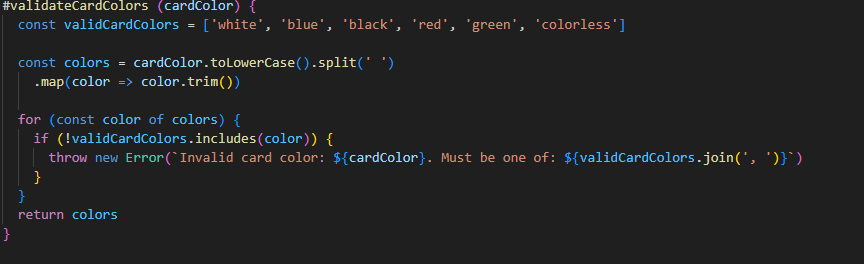
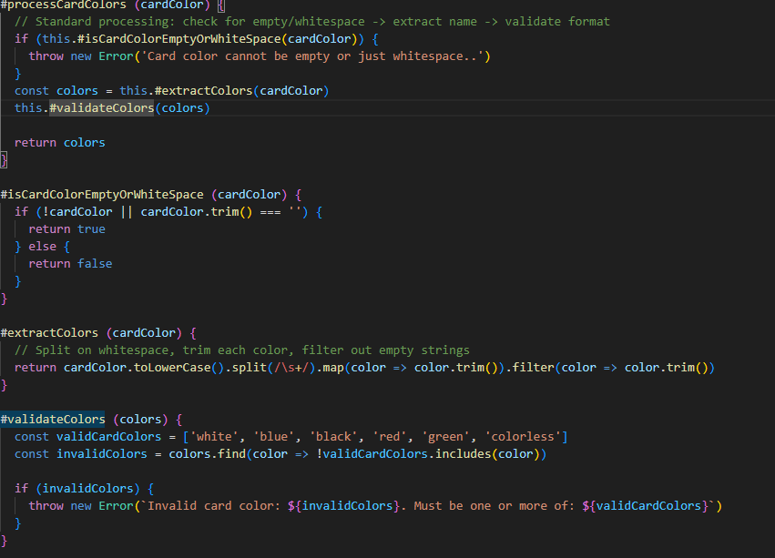
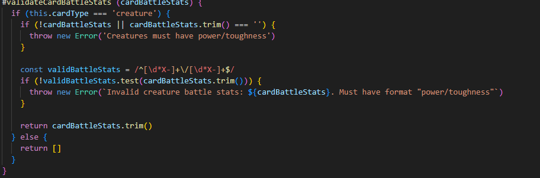
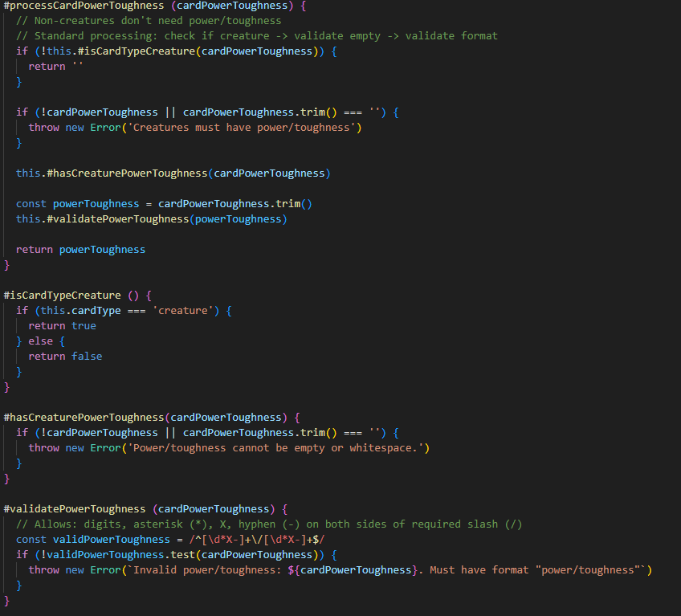
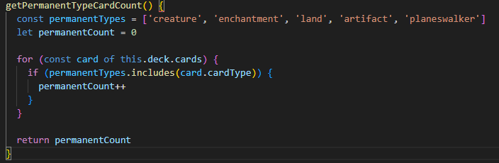
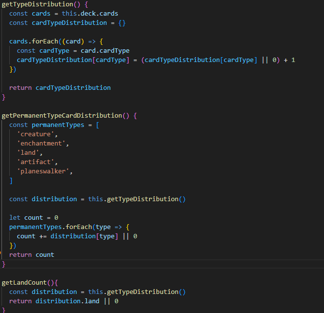
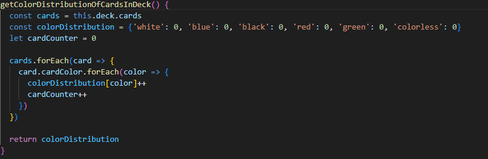
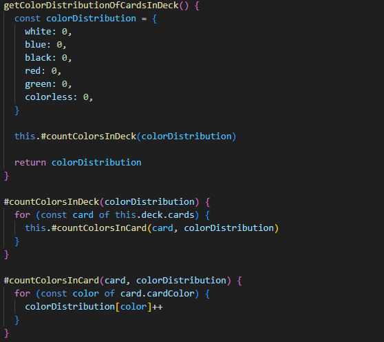
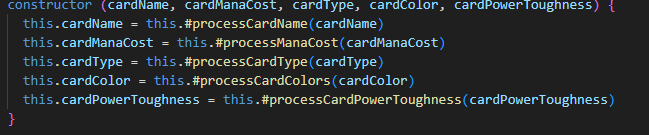
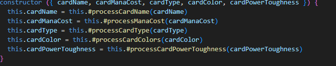

# Kapitel 2

## Namn

| Namn | Förklaring | Reflektion och regler från Clean Code |
|------|------------|---------------------------------------|
| `addNewCard()` | Metodnamn på metod som lägger till ett kort i kortleken. | **Don't Add Gratuitous Context:** ordet "New" har ingen betydelse här och således skulle kunna tas bort.  **Make Meaningful Distinctions:** I det här fallet finns det bara en metod för att lägga till kort i kortleken och då har "New" ingen distinktion.  **Avoid disinformation:** `addNewCard()` säger till användaren av modulen att endast ett kort kan läggas till åt gången, vilket inte är sant.  **Intention-Revealing Names:** Berättar vad metoden gör. |
| `#manaCurveReducer()` | Metodnamn på metod som tar fram värden som behövs för att räkna ut medelvärdet. | **Intention-Revealing Names:** metoden berättar inte vad den gör, utan hur implementationen är gjort.  **Avoid Mental Mapping:** istället för att kommunicera vad metoden gör så måste läsaren komma ihåg att "reducer" tar fram värden för att räkna ut medelvärden.  **Method Names:** `#manaCurveReducer()` är inte ett verb vilket gör det oklart vad det är som händer. Nu låter det som "Den där som använder reducer" istället för vad som händer. |
| `getTypeOfDeck()` | Metodnamn på metod som tar fram kortlekens arketyp. | **Make Meaningful Distinctions:** Det finns flera olika saker "type" kan betyda nu som skapar förvirring.  **Use Pronounceable Names:** Metodens namn är enkel att uttala. |
| `#handleZeroSpells()` | Metodname på metod som hanterar division med 0 | **Avoid Mental Mapping:** Namnet kommunicerar inte hur divisionen hanteras. |
| `getColorDistributionOfCardsInDeck()` | | **Use Pronounceable Names:** metodnamnet är lite långt och blir således svårt att uttala.  **Don't Add Gratuitous Context:** Det finns redan information som är uppenbar. `getColorDistribution()` är tillräckligt. |

## Reflektion Namngivning

Efter att ha läst kapitel 2 så insåg jag att det är väldigt lätt att namnge otydligt. Att det är lockande att lägga på extra ord på namnen för att försöka göra det tydligare, men det försämrade ofta bara readabilityn och understandabilityn i koden.

Varje ord i ett namn ska ha ett syfte. jag märkte att jag brutit mot den regeln, som exempelvis `getColorDistributionOfCardsInDeck()` i min kod. Namnet blev alldeles för långt kontexten som metoden används i ger redan informationen att en kortlek analyseras. `getColorDistribution()` hade varit både lättare att läsa och förstå.

En annan sak från boken är att undvika desinformation. Namn ska inte göra något de inte säger att de kommer att göra. I min kod som exempel så säger `addNewCard()` att den lägger till kort i singular, men kan faktiskt lägga till flera kort. Dessutom är "New" i det här fallet helt onödigt för varje kort som är tillagt är ju nytt, så ett lämpligare namn är `addCards()`. Just nu vilseleder det bara läsaren

Att ha ett kortare namn som fortfarande är innehållsrikt gör det mycket tydligare för läsaren, oavsett om läsaren är jag själv i framtiden eller någon annan.

Enligt boken så ska vi inte vara rädda att använda långa namn. Att ett långt beskrivande namn är bättre än en kommentar. Jag håller inte helt med. Långa namn blir lätt opraktiska och otydliga. Komplexa problem i koden eller när saker blir väldigt specifika behöver man både ett bra namn och en kommentar för att öka understandabilityn.

Varje ord i namnen ska tjäna ett syfte. Om kontexten runt om kring redan ger informationen ska den inte upprepas i namnet. Bra namngivning handlar om att balansera readability mot understandability och det viktigaste är att koden är lätt att läsa och förstå oavsett vem läsaren är.

---

# Kapitel 3

## Metodnamn och Reflektion

| Metodnamn | Kod | Antal rader (ej ws) | Reflektion |
|-----------|-----|---------------------|------------|
| `#validateCardColors` | **Före refaktorering:** [Före](./img/validatecardcolor.png)  **Efter refaktorering:** [Efter](./img/validatecardcolor_refactored.png) | 10 | **Regler som följs:** Small (10 rader är hanterbart), Function Arguments (1 parameter), Use Descriptive Names, Prefer Exceptions (kastar exception vid fel).  **Regler som bryts:** Do One Thing (transformerar input OCH validerar OCH returnerar data), Command Query Separation (både kastar exception OCH returnerar värde), One Level of Abstraction (blandar string-manipulation med validering), DRY.  **Förändring:** Dela upp i tre metoder: `#extractColors()` för transformation, `#validateColors()` för validering, och `#processCardColors()` som orchestrerar. |
| `#validateCardBattleStats` | **Före refaktorering:** [Före](./img/validatecardbattlestats.png)  **Efter refaktorering:** [Efter](./img/validatecardbattlestats_refactored.png) | 13 | **Regler som följs:** Small (13 rader är hanterbart), Function Arguments (1 parameter), Use Descriptive Names (namnet indikerar validering av battle stats), Prefer Exceptions (kastar exception vid fel).  **Regler som bryts:** Do One Thing (kollar korttyp OCH validerar empty OCH validerar format med regex OCH trimmar OCH returnerar - 5 olika ansvarsområden), Command Query Separation (både kastar exception OCH returnerar värde), One Level of Abstraction (blandar type-checking med string-manipulation och regex-validering), Avoid Disinformation (returnerar tom array `[]` för non-creatures men string för creatures - inkonsekvent datatyp).  **Förändring:** Dela upp i tre metoder: `#isCreature()` för type-check, `#validatePowerToughnessFormat()` för regex-validering, och `#processCardPowerToughness()` som orchestrerar. Returnera tom sträng `''` istället för `[]` för datatyp-konsistens. |
| `getPermanentTypeCardCount()` | **Före refaktorering:** [Före](./img/getPermanentTypeCardCount.png)  **Efter refaktorering:** [Efter](./img/getPermanentTypeCardCount_refactored.png) | 9 | **Regler som följs:** Small (9 rader är hanterbart), Function Arguments niladic, Use Descriptive Names (namnet beskriver vad metoden returnerar).  **Regler som bryts:** One Level of Abstraction (blandar högnivå-koncept "räkna permanents" med lågnivå loop-iteration och array includes-check), Command Query Separation (muterar permanentCount variabel inuti loop).  **Förändring:** Återanvänd `getTypeDistribution()` istället för att iterera över alla kort direkt (följer DRY bättre) |
| `getColorDistributionOfCardsInDeck` | **Före refaktorering:** [Före](./img/getColorDistribution.png)  **Efter refaktorering:** [Efter](./img/getcolordistribution_refactor_.png) | 11 | **Regler som följs:** Small (11 rader är hanterbart), Function Arguments niladic, Have No Side Effects (metoden ändrar inte tillstånd, skapar nytt objekt).  **Regler som bryts:** Don't Add Gratuitous Context (namnet är alldeles för långt - "OfCardsInDeck" är onödigt när vi redan är i ManaAnalyzer som analyserar ett deck), Do One Thing (initierar distribution, itererar över kort, itererar över färger, muterar counter - flera ansvarsområden), One Level of Abstraction (nested forEach loops blandar högnivå "räkna färger" med lågnivå iteration och array-access).  **Förändring:** Byt namn till `getColorDistribution()`. Dela upp i hjälpmetoder: `#countColorsInDeck()` och `#countColorsInCard()` för att separera abstraktionsnivåer. Ta bort onödig cardCounter variabel. Efter uppdelning blir varje metod mer fokuserad och följer Do One Thing bättre. |
| Card constructor | **Före förslag**[Före](./img/card_constructor.png)   **Efter förslag**[Efter](./img/card_constructor_suggestion.png) | 6 | Regler som följs: Small (endast 6 rader), Do One Thing (initialiserar ett Card-objekt), One Level of Abstraction (alla anrop på samma nivå - delegerar till process-metoder), Use Descriptive Names (tydliga parameternamn).  Regler som bryts: Function Arguments (5 parametrar är för många, boken rekommenderar så få som möjligt)   Förändring: Använd parameter object istället för 5 separata parametrar. |

## Reflektion funktioner

Efter att han läst igenom kapitel 3 och kollat igenom mina metoder insåg jag att många av dem gjorde för mycket på samma gång. Enligt boken ska en mettod göra en sak åt gången. Mina metoder gjorde många saker samtidigt.

Ett exempel är `#validateCardColor()` (`processCardColor()` efter refaktorering) som gjorde fem saker samtidigt. Ändrade all text till små bokstäver, delade upp strängen, validerade så att färgformatet var korrekt, kastade fel och returnerade. När jag delade upp den i mindre små metoder så blev varje del tydligare vad den delen gjorde, men koden blev mycket längre. Det fick mig att undra om uppdelningen verkligen blev bättre då det blev mycket mer kod även om det blev enklare att följa med i vad som sker.

Uppdelningen av metoder ledde också till positiva upptäckter. När jag refaktorerade `getPermanentTypeCardCount()` insåg jag att jag kunde återanvända den befintliga metoden `getTypeDistribution()` istället för att iterera över alla kort. Från början så loopade metoden igenom `this.deck.card` och kollade varje kort, men efter refaktoreringen så kunde jag hämta ut distrubitionen direkt. Att dela upp koden i mindre funktioner hjälpte alltså mig att se kopplingar och återanvändningsmöjligheter som jag hade missat. Det hjälpte till med att hålla metoderna på samma abstraktionsnivåer så att flödet blev mycket tydligare.

Något som jag kom fram till efter att ha provat att göra så många små metoder är att det är bra när det leder till ökad förståelse och läsbarhet, men inte bara för sakens skull att ha små metoder och fragmentering av metoder också faktiskt kan göra det svårare när en 15 rader lång metod blir fyra olika små metoder på 30 rader kod istället.

---

# Reflektion Egen kod kvalitet

När jag har kollat igenom min ser jag brister på flera ställen. En stor brist är att jag inte har tänkt på läsaren av koden tillräckligt. Jag har helt enkelt fokuserat på att koden ska fungera och inte att göra den tillräckligt enkel att förstå. Det syns i namngivningen där jag konsekvent har lagt till onödiga ord som bryter mot Don't Add Gratuitous Context. Det försämrar readability eftersom läsaren måste läsa fler ord som inte tillför något.

Jag har använt samma ord för olika koncept och skrivit namn som är långa och inte tillräckligt tydliga vilket bryter mot Make Meaningful Distinctions vilket kräver mental mapping. Ett problem är också Avoid Disinformation där namn som som i `addNewCard()` som antyder att den bara lägger till ett kort i taget, vilket inte stämmer då den kan lägga till flera samtidigt.

Metoderna skrevs från början med att göra många saker på en gång, men de har refaktoriserats allt efter som. Efter uppdelning i mindre funktioner blev varje del tydligare, men jag såg också att koden växte betydligt.

Kodkvaliteten visar på att jag inte har tänkt tillräckligt på att göra koden så läsbar som möjligt och enkel att underhålla. I framtiden måste jag alltså tänka ännu mer på att varje namn och funktion ska hjälpa läsaren och även mig själv.